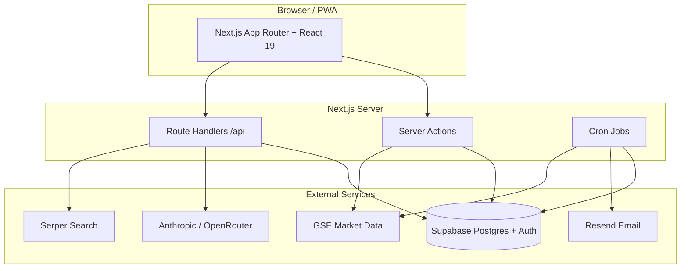

# Architecture

This document describes how **inv.labs** (Investment Simulator) is structured for reviewers and maintainers.

## System overview

## Application layers

| Layer | Location | Responsibility |
|-------|----------|----------------|
| **Pages** | `src/app/` | App Router routes: marketing, auth, dashboard, admin |
| **Server Actions** | `src/app/actions/` | Mutations: trades, portfolio, gamification, partners |
| **API routes** | `src/app/api/` | Ato chat/research, cron, referral tracking |
| **UI components** | `src/components/` | Feature and landing components (Radix + Tailwind) |
| **Domain logic** | `src/lib/` | Market data, AI, email, portfolio math, Supabase clients |
| **Database** | `supabase/` | Schema, migrations, RLS policies |

## Core domains

### Virtual trading (GSE stocks)

- Users start with **GH₵10,000** virtual cash (`profiles.cash_balance`).
- Trades flow: `executeStockTrade` (server action) → Postgres function `execute_stock_trade` (atomic, row-locked).
- Fees mirror Ghana’s structure (brokerage, GSE, SEC levies) computed server-side.
- **Limit orders** are stored and filled by `/api/cron/process-limit-orders`.

### Mutual funds

- Fund catalog and NAV history in Supabase (`schema_mutual_funds.sql` + migrations).
- Subscriptions/redemptions via `src/app/actions/mutual-funds.ts`.
- NAV refresh: `/api/cron/update-mutual-funds`.

### Ato (AI assistant)

| Mode | Entry | Notes |
|------|-------|-------|
| Chat | `/api/ato/chat` | Educational coach; portfolio context via `ato-context.ts` |
| Deep research | `/api/ato/research` | Serper + content fetch + LLM synthesis; cached in `ato_research_cache` |
| Agent | `/api/ato/agent` | Tool-use loop with trade adapter (feature-flagged) |

System prompts enforce **education-only** behavior (no buy/sell recommendations). See `src/lib/ai/ato-service.ts`.

### Gamification & learning

- XP, badges, courses, challenges, leaderboard (migrations under `supabase/migrations/20260225_*` through `20260331_*`).
- Public leaderboard uses **SECURITY DEFINER** functions to expose safe columns without leaking private profile data.

### Partners & referrals

- Partner dashboard, referral clicks (`/api/referral-click`), admin partner reports.
- RBAC: `profiles.role` (`user` | `admin` | `partner`) with `public.is_admin()` helper.

## Authentication & authorization

- **Supabase Auth** (email/OAuth) with session cookies via `@supabase/ssr`.
- **Row Level Security (RLS)** on user-owned tables; service role used only in cron and privileged server paths.
- Admin routes under `src/app/admin/` should assume `is_admin()` checks in actions (verify per route when reviewing).

## Cron & background work

Configured in `vercel.json`:

| Schedule | Route | Purpose |
|----------|-------|---------|
| Daily 08:00 UTC | `/api/cron/re-engagement` | Inactive-user emails via Resend |
| Daily 12:00 UTC | `/api/cron/process-limit-orders` | Fill pending limit orders |

Additional routes (configure in Vercel dashboard or invoke manually with `Authorization: Bearer $CRON_SECRET`):

| Route | Purpose |
|-------|---------|
| `/api/cron/update-mutual-funds` | Refresh mutual fund NAV data |
| `/api/cron/update-macro-snapshot` | Bank of Ghana policy rate / macro cache |

All cron handlers validate `CRON_SECRET` in production.

## Data integrity highlights

- **Atomic trades**: `execute_stock_trade` uses `FOR UPDATE` on profile rows to prevent double-spend race conditions.
- **Server-side pricing**: Trade actions re-validate quantity/price; fees computed on server, not trusted from client alone.
- **AI boundaries**: Prompts + feature flags; research results cached with TTL in Postgres.

## PWA

`next-pwa` is enabled for production builds (`next.config.ts`); disabled in development.

## Key files for review

| Concern | Start here |
|---------|------------|
| Trade execution | `src/app/actions/stocks.ts`, `supabase/migrations/20260301_atomic_stock_trades.sql` |
| Auth / RLS | `supabase/migrations/20260221_auth_overhaul.sql` |
| AI safety | `src/lib/ai/ato-service.ts`, `src/app/api/ato/chat/route.ts` |
| Cron security | `src/app/api/cron/*/route.ts` |
| Feature flags | `src/lib/config/feature-flags.ts` |
